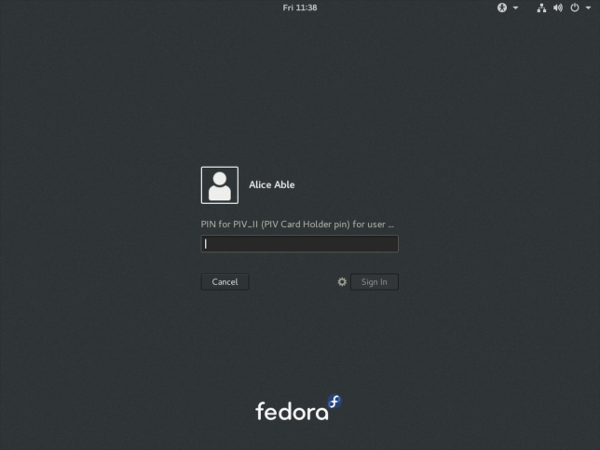

Smart card login with YubiKey NEO
=================================

In this post I give an overview of smart cards and their potential
advantages, and share my adventures in using a Yubico `YubiKey NEO`_
device for smart card authentication with FreeIPA_ and SSSD_.

.. _FreeIPA: https://www.freeipa.org/page/Main_Page
.. _SSSD: https://fedorahosted.org/sssd/

Smart card overview
-------------------

`Smart cards`_ with cryptographic processors and secure key storage
(private key generated on-device and cannot be extracted) are an
increasingly popular technology for secure system and service login,
as well as for signing and encryption applications (e.g. code
signing, OpenPGP).  They may offer a security advantage over
traditional passwords because private key operations typically
require the user to enter a PIN.  Therefore the smart card is two
factors in one: both *something I have* and *something I know*.

The inability to extract the private key from a smart card also
provides an advantage over software HOTP/TOTP tokens which, in the
absense of other security measures such as encrypted filesystem on
the mobile device, allow an attacker to extract the OTP seed.  And
because public key cryptography is used, there is no OTP seed or
password hash sitting on a server, waiting to be exfiltrated and
subjected to offline attacks.

For authentication applications, a smart card carries an X.509
certificate alongside a private key.  A login application would read
the certificate from the card and validate it against trusted CAs
(e.g. a company's CA for issuing smart cards).  Typically an OCSP or
CRL check would also be performed.  The login application then
challenges the card to sign a nonce, and validates the signature
with the public key from the certificate.  A valid signature attests
that the bearer of the smart card is indeed the subject of the
certificate.  Finally, the certificate is then mapped to a user
either by looking for an exact certificate match or by extracting
information about the user from the certificate.

.. _Smart cards: https://en.wikipedia.org/wiki/Smart_card
.. _YubiKey NEO: https://www.yubico.com/products/yubikey-hardware/yubikey-neo/

Test environment
----------------

In my smart card investigations I had a FreeIPA server with a single
Fedora 24 desktop host enrolled.  ``alice`` was the user I tested
with.  To begin with, she had no certificates and used her password
to log in.

I was doing all of my testing on virtual machines, so I had to
enable USB passthrough for the YubiKey device.  This is
straightforward but you have to ensure the IOMMU is enabled in both
BIOS and kernel (for Intel CPUs add ``intel_iommu=on`` to the kernel
command line in GRUB).

In ``virt-manager``, after you have created the VM (it doesn't need
to be running) you can *Add Hardware* in the *Details* view, then
choose the YubiKey NEO device.  There are no doubt ``virsh``
incantations or other ways to establish the passthrough.

Finally, on the *host* I stopped the ``pcscd`` smart card daemon
to prevent it from interfering with passthrough::

  # systemctl stop pcscd.service pcscd.socket

Provisioning the YubiKey
------------------------

For general smart card provisioning steps, I recommend `Nathan
Kinder's post`_ on the topic.  But the YubiKey NEO is *special* with
its own steps to follow!  First install the ``ykpers`` and
``yubico-piv-tool`` packages::

  sudo dnf install -y ykpers yubico-piv-tool

.. _Nathan Kinder's post: https://blog-nkinder.rhcloud.com/?p=179

If we run ``yubico-piv-tool`` to find out the version of the PIV
applet, we run into a problem because a new YubiKey comes configured
in OTP mode::

  [dhcp-40-8:~] ftweedal% yubico-piv-tool -a version
  Failed to connect to reader.

The YubiKey NEO supports a variety of operation modes, including
hybrid modes::

   0    OTP device only.
   1    CCID device only.
   2    OTP/CCID composite device.
   3    U2F device only.
   4    OTP/U2F composite device.
   5    U2F/CCID composite device.
   6    OTP/U2F/CCID composite device.

(You can also add ``80`` to any of the modes to configure *touch to
eject*, or *touch to switch modes* for hybrid modes).

We need to put the YubiKey into CCID (*Chip Card Interface Device*,
a standard USB protocol for smart cards) mode.  I originally
configured the YubiKey in mode ``86`` but could not get the card to
work properly with USB passthrough to the virtual machine.  Whether
this was caused by the eject behaviour or the fact that it was a
hybrid mode I do not know, but reconfiguring it to mode ``1`` (CCID
only) allowed me to use the card on the guest.

::

  [dhcp-40-8:~] ftweedal% ykpersonalize -m 1
  Firmware version 3.4.6 Touch level 1541 Program sequence 1

  The USB mode will be set to: 0x1

  Commit? (y/n) [n]: y

Now ``yubico-piv-tool`` can see the card::

  [dhcp-40-8:~] ftweedal% yubico-piv-tool -a version
  Application version 1.0.4 found.

https://developers.yubico.com/yubico-piv-tool/YubiKey_PIV_introduction.html
Now we can initialise the YubiKey by setting a new *management key*,
PIN and *PIN Unblocking Key (PUK)*.  As you can probably guess, the
management key protects actions like generating keys and importing
certificates, the PIN protects private key operations in regular
use, the the PUK is kind of in between, allowing the PIN to be reset
if the maximum attempts are exceeded.  The current (default) PIN and
PUK need to be given in order to reset them.

::

  % KEY=`dd if=/dev/random bs=1 count=24 2>/dev/null | hexdump -v -e '/1 "%02X"'`
  % echo $KEY
  CC044321D49AC1FC40146AD049830DB09C5AFF05CD843766
  % yubico-piv-tool -a set-mgm-key -n $KEY
  Successfully set new management key.

  % PIN=`dd if=/dev/random bs=1 count=6 2>/dev/null | hexdump -v -e '/1 "%u"'|cut -c1-6`
  % echo $PIN
  167246
  % yubico-piv-tool -a change-pin -P 123456 -N $PIN
  Successfully changed the pin code.

  % PUK=`dd if=/dev/random bs=1 count=6 2>/dev/null | hexdump -v -e '/1 "%u"'|cut -c1-8`
  % echo $PUK
  24985117
  % yubico-piv-tool -a change-puk -P 12345678 -N $PUK
  Successfully changed the puk code.

Next we must generate a private/public keypair on the smart card.
Various slots are available for different purposes, with different
PIN-checking behaviour.  The `Certificate slots`_ page on the Yubico
wiki gives the full details.  We will use slot ``9e`` which is for
*Card Authentication* (PIN is not needed for private key
operations).  It is necessary to provide the management key on the
command line, but the program also prompts for it (I'm not sure why
this is the case).

.. _Certificate slots: https://developers.yubico.com/PIV/Introduction/Certificate_slots.html

::

  % yubico-piv-tool -k $KEY -a generate -s 9e
  Enter management key: CC044321D49AC1FC40146AD049830DB09C5AFF05CD843766
  -----BEGIN PUBLIC KEY-----
  MIIBIjANBgkqhkiG9w0BAQEFAAOCAQ8AMIIBCgKCAQEApT5tb99jr7qA8zN66Dbl
  fu/Jh+F0nZvp7FXZRJQH12KgEeX4Lzu1S10b1HQ0lpHZWcqPQh2wbHaC8U7uYSLW
  LqsjmFeJrskAerVAAH8v+tzy6DKlJKaLjAt8qWEJ1UWf5stJO3r9RD6Z80rOYPXT
  MsKxmsb22v5lbvZTa0mILQeP2e6m4rwPKluQrODYkQkQcYIfedQggmYwo7Cxl5Lu
  smtes1/FeUlJ+DG3mga3TrZd1Fb+wDJqQU3ghLul9qLNdPYyxdwDKSWkIOt5UusZ
  2A8qECKZ8Wzv0IGI0bReSZYHKjhdm4aMMNubtKDuem/nUwBebRHFGU8zXTSFXeAd
  gQIDAQAB
  -----END PUBLIC KEY-----
  Successfully generated a new private key.

We then use this key to create a *certificate signing request (CSR)*
via ``yubico-piv-tool``.  Although slot ``9e`` does not require the
PIN, other slots do require it, so I've included the ``verify-pin``
action for completeness::

  % yubico-piv-tool -a verify-pin \
      -a request-certificate -s 9e -S "/CN=alice/"
  Enter PIN: 167246
  Successfully verified PIN.
  Please paste the public key...
  -----BEGIN PUBLIC KEY-----
  MIIBIjANBgkqhkiG9w0BAQEFAAOCAQ8AMIIBCgKCAQEApT5tb99jr7qA8zN66Dbl
  fu/Jh+F0nZvp7FXZRJQH12KgEeX4Lzu1S10b1HQ0lpHZWcqPQh2wbHaC8U7uYSLW
  LqsjmFeJrskAerVAAH8v+tzy6DKlJKaLjAt8qWEJ1UWf5stJO3r9RD6Z80rOYPXT
  MsKxmsb22v5lbvZTa0mILQeP2e6m4rwPKluQrODYkQkQcYIfedQggmYwo7Cxl5Lu
  smtes1/FeUlJ+DG3mga3TrZd1Fb+wDJqQU3ghLul9qLNdPYyxdwDKSWkIOt5UusZ
  2A8qECKZ8Wzv0IGI0bReSZYHKjhdm4aMMNubtKDuem/nUwBebRHFGU8zXTSFXeAd
  gQIDAQAB
  -----END PUBLIC KEY-----
  -----BEGIN CERTIFICATE REQUEST-----
  MIICUzCCAT0CAQAwEDEOMAwGA1UEAwwFYWxpY2UwggEiMA0GCSqGSIb3DQEBAQUA
  A4IBDwAwggEKAoIBAQClPm1v32OvuoDzM3roNuV+78mH4XSdm+nsVdlElAfXYqAR
  5fgvO7VLXRvUdDSWkdlZyo9CHbBsdoLxTu5hItYuqyOYV4muyQB6tUAAfy/63PLo
  MqUkpouMC3ypYQnVRZ/my0k7ev1EPpnzSs5g9dMywrGaxvba/mVu9lNrSYgtB4/Z
  7qbivA8qW5Cs4NiRCRBxgh951CCCZjCjsLGXku6ya16zX8V5SUn4MbeaBrdOtl3U
  Vv7AMmpBTeCEu6X2os109jLF3AMpJaQg63lS6xnYDyoQIpnxbO/QgYjRtF5Jlgcq
  OF2bhoww25u0oO56b+dTAF5tEcUZTzNdNIVd4B2BAgMBAAGgADALBgkqhkiG9w0B
  AQsDggEBADvyL13ayXRDWmRJ1dSi4lE9l128fy3Lt/1XoAC1D+000hWkXOPA+K8j
  gR/Yg99K9v3U2wm6wtk2taEeogc4TebVawXezjw/hu4wq2sta3zVVJC9+yRrUeai
  P+Gvj0KNesXK5MyHGpeiPb3SA/2GYYK04suM6a1vpA+sBvrca39klpgBrYY0N/9s
  VE4gBBNhQa9jN8E9VMQXEPxYVH1tDrp7bRxg6V5spJb2oit6H+7Pe7xSC95ByCXw
  Msprhk+B2nkrVaco5R/ZOG0jZdMOMOJXCuTbWKOaCDEN5hsLNdua6uBpiDCJ5v1I
  l0Xmf53DC7jceF/XgZ0LUzbGzTDcr3o=
  -----END CERTIFICATE REQUEST-----

``yubico-piv-tool -a request-certificate`` is not very flexible; for
example, it cannot create a CSR with *request extensions* such as
including the user's email address or Kerberos principal name in the
*Subject Alternative Name* extension.  For such non-trivial use
cases, ``openssl req`` or other programs can be used instead, with a
PKCS #11 module providing acesss to the smart card's signing
capability.  `Nathan Kinder's post`_ provides full details.

With CSR in hand, ``alice`` can now request a certificate from the
IPA CA.  I have covered this procedure in previous articles so I'll
skip it here, except to add that it is necessary to use a profile
that saves the newly issued certificate to the subject's
``userCertificate`` LDAP attribute.  This is how SSSD matches
certificates in smart cards with users.

Once we have the certificate (in file ``alice.pem``) we can import
it onto the card::

  % yubico-piv-tool -k $KEY -a import-certificate -s 9e -i alice.pem
  Enter management key: CC044321D49AC1FC40146AD049830DB09C5AFF05CD843766
  Successfully imported a new certificate.

Configuring smart card login
----------------------------

OpenSC provides a PKCS #11 module for interfacing with PIV smart
cards, among other things::

  # dnf install -y opensc

Enable smart card authentication in ``/etc/sssd.conf``::

  [pam]
  pam_cert_auth = True

Then restart SSSD::

  # systemctl restart sssd

Next, enable the OpenSC PKCS #11 module in the system NSS database::

  # modutil -dbdir /etc/pki/nssdb \
      -add "OpenSC" -libfile opensc-pkcs11.so

We also need to add the IPA CA cert to the system NSSDB.  This will
allow SSSD to validate certificates from smart cards::

  # certutil -d /etc/ipa/nssdb -L -n 'IPA.LOCAL IPA CA' -a \
    | certutil -d /etc/pki/nssdb -A -n 'IPA.LOCAL IPA CA' -t 'CT,C,C'

One hiccup I had was that SSSD could not talk to the OCSP server
indicated in the *Authority Information Access* extension on the
certificate (due to my DNS not being set up correctly).  I had to
tell SSSD not to perform OCSP checks.  The ``sssd.conf`` snippet
follows.  Do not do this in a production environment.

::

  [sssd]
  ...
  certificate_verification = no_ocsp

That's pretty much all there is to it.  After this, I was able to
log in as ``alice`` using the YubiKey NEO.  When logging in with the
card inserted, instead of being prompted for a password, GDM prompts
for the PIN.  Enter the pin, and it lets you in!

Conclusion
----------

I mentioned (or didn't mention) a few standards related to smart
card authentication.  A quick review of them is warranted:

- CCID is a USB smart card interface standard.

- PIV_ (*Personal Identify Verification*) is a smart card standard
  from NIST.  It defines the slots, PIN behaviour, etc.

- PKCS #15 is a token information format.  OpenSC provides an PKCS
  #15 emulation layer for PIV cards.

- PKCS #11 is a software interface to cryptographic tokens.  Token
  and HSM vendors provide PKCS #11 *modules* for their devices.
  OpenSC provides a PKCS #11 interface to PKCS #15 tokens (including
  emulated PIV tokens).

.. _PIV: http://nvlpubs.nist.gov/nistpubs/SpecialPublications/NIST.SP.800-73-4.pdf

It is appropriate to mention `*pam_pkcs11*`_, which is also part of
the OpenSC project, as an alternative to SSSD.  More configuration
is involved, but if you don't have (or don't want) an external
identity management system it looks like a good approach.

.. _*pam_pkcs11*: https://github.com/OpenSC/pam_pkcs11

You might remember that I was using slot ``9e`` which doesn't
require a PIN, yet I was still prompted for a PIN when logging in.
There are a couple of issues to tease apart here.  The first issue
is that although PIV cards do not require the PIN for private key
operations on slot ``9e``, the ``opensc-pkcs11.so`` PKCS #11 module
does not correctly report this.  As an alternative to OpenSC, Yubico
provide their own PKCS #11 module called `*YKCS11*`_ as part of
``yubico-piv-tool`` but ``modutil`` did not like it.  Nevertheless,
a peek at its source code leads me to believe that it too declares
that the PIN is required regardless of the slot in use.  I could not
find much discussion of this discrepancy so I will raise some
tickets and hopefully it can be addressed.

.. _*YKCS11*: https://developers.yubico.com/yubico-piv-tool/YKCS11_release_notes.html

The second issue is that SSSD requires the PIN and uses it to log
into the token, even if the token says that a PIN is not required.
Again, I will start a discussion to see if this is really the
intended behaviour (perhaps it is).

The YubiKey NEO features a wireless (NFC) interface.  I haven't
played with it yet, but all the smart card features are available
over that interface.  This lends weight to fixing the issues
preventing PIN-less usage.

A final thought I have about the user experience is that it would be
nice if user information could be derived or looked up based on the
certificate(s) in the smart card, and a user automatically selected,
instead of having to first specify "I am ``alice``" or whoever.  The
information is there on the card after all, and it is one less step
for users to perform.  If PIN-less usage can be addressed, it would
mean that a user can just approach a machine, plug in their smart
card and hi ho, off to work they go.  There are some indications
that this does work with GDM and ``pam_pkcs11``, so if you know how
to get it going with SSSD I would love to know!
