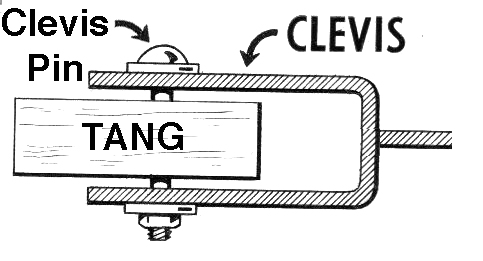

Introduction to Tang and Clevis
===============================

In this post I continue the discussion of network-bound decryption
and introduce *Tang* and *Clevis*, new unlock tools that supersede
*Deo* (which was covered `in an earlier post`_).

.. _in an earlier post: 2015-09-09-deo-tls.html

Deo is dead. Long live Tang.
----------------------------

Nathaniel McCallum discovered a key encryption protocol based on
ElGamal with a desirable security characteristic: *no one but the
party decrypting the secret can learn the secret*.  It was reviewed
and refined into *McCallum-Relyea (MR) exchange*.  With Deo, the
server decrypted (thus *learned*) the key and sent it back to the
client (through an encrypted channel).  McCallum-Relyea exchange
avoids this.  A new protocol based on MR was developed, called
*Tang*.

Another perceived drawback of Deo was its use of X.509 certificates
for TLS and for encryption, making it complex to deploy.  The Tang
protocol is simpler and avoids X.509.

I will avoid going into the details of the cryptography or the
protocol in this post, but will include links at the end.

Clevis
------

Using Tang to bind data to a network is great, but there are many
other things we might want to bind our data to, such as passwords,
TPM, biometrics, Bluetooth LE beacons, et cetera.  It would also be
nice to define policies - possibly nested - about how many of what
data binders must succeed in order to decrypt or "unlock" a secret.
The point here is that unlock policy should be driven by business or
and/or user needs, not by technology.  The technology must enable
but not constrain the policy.

Enter *Clevis*, the pluggable client-side unlock framework.
Plugins, which are called *pins*, implement different kinds of
bindings.  Clevis comes with a handful a pins including ``pwd``
(password) and ``https`` (PUT and GET the secret; a kind of escrow).
The ``tang`` pin is provided by Tang to avoid circular dependencies.

The ``sss`` pin provides a way to "nest" pins, and also provides *k
of n* threshold unlocking.  "SSS" stands for `*Shamir's Secret
Sharing*`_, the algorithm that makes this possible.

.. _*Shamir's Secret Sharing*: https://en.wikipedia.org/wiki/Shamir's_Secret_Sharing

LUKS volume decryption, which was implemented in Deo, has not yet
been implemented in Clevis, but it is a high priority.

By the way, if you were wondering about the terminology, a *clevis*,
*clevis pin* and *tang* together form a kind of shackle.

TLS private key decryption
--------------------------

Let's revisit the TLS private key decryption use case from my
earlier Deo post, and update the solution to use Clevis and Tang.

Recall the encryption command, which required the user to input the
TLS private key's passphrase, then encrypted it with Deo, storing it
at a location determined by convention::

  # (stty -echo; read LINE; echo -n "$LINE") \
    | deo encrypt -a /etc/ipa/ca.pem deo.ipa.local \
    > /etc/httpd/deo.d/f22-4.ipa.local:443

We will continue to use the same file storage convention.  Clevis,
unlike Tang, does not receive a secret to be encrypted but instead
generates one and tells us what it is.  Let's run ``clevis provision``
with the Tang pin and see what it gives us::

  # clevis provision -P '{"type": "tang", "host": "f23-1.ipa.local"}' \
    -O /etc/httpd/tang.d/f22-4.ipa.local:443

  The server advertised the following signing keys:

          0300AF3BF089D8D896DBE7CCE5E2BEC342C5A107
          B4A47300CA5819C34C537098D53CF9392AF06866
          1B581235DCA09D920EE5E31D5EFB44406A441DF5
          E750E646EBB0DC

  Do you wish to trust the keys? [yn] y
  709DAFCBC8ACF879D1AC386798783C7E

Breaking down the command, the ``-P`` argument is a JSON ``tang``
pin configuration object, specifying the Tang server's ``host``
name.  The argument to ``-O`` specifies the output filename.

The program prints the signing key(s) and asks if we want to trust
them.  Tang is a *trust on first use (TOFU)* protocol.  Out-of-band
validation is possible but not yet implemented (there is a `ticket
for DNSSEC support`_).

.. _ticket for DNSSEC support: https://github.com/npmccallum/clevis/issues/2

Having trusted the keys, the program performs the Tang encryption,
saves the metadata in the specified output file, and finally prints
the secret: ``709DAFCBC8ACF879D1AC386798783C7E``.

We now need to update the passphrase on the TLS private key with
the secret that Clevis generated::

  # openssl rsa -aes128 < key.pem > newkey.pem && mv newkey.pem key.pem
  Enter pass phrase:
  writing RSA key
  Enter PEM pass phrase:
  Verifying - Enter PEM pass phrase:

OpenSSL first asked for the *original* passphrase to decrypt the
private key, then asks (twice) for a new passphrase, which shall be
the secret Clevis told us.

Now we must change the helper script that unlocks the private key.
Recall the definition of the Deo helper::

  #!/bin/sh
  DEO_FILE="/etc/httpd/deo.d/$1"
  [ -f "$DEO_FILE" ] && deo decrypt < "$DEO_FILE" && echo && exit
  exec /bin/systemd-ask-password "Enter SSL pass phrase for $1 ($2) : "

The Clevis helper is similar::

  #!/bin/sh
  CLEVIS_FILE="/etc/httpd/clevis.d/$1"
  [ -f "$CLEVIS_FILE" ] && clevis acquire -I "$CLEVIS_FILE" && echo && exit
  exec /bin/systemd-ask-password "Enter SSL pass phrase for $1 ($2) : "

The ``clevis acquire -I "$CLEVIS_FILE"`` invocation is the only
substantive change.  Now we can finally ``systemctl restart httpd``
and observe that the key is decrypted automatically, without
prompting the operator.

What are the possible downsides to this approach?  First, due to
limitations in Apache's passphrase acquisition at present it is
possible only to use Clevis pins that do not interact with the user
or write to standard output.  Second, the secret is no longer
controlled by the user doing the provisioning - the TLS private key
must be re-encrypted under the new passphrase generated by Clevis,
and if the Tang server is unavailable, that is the passphrase that
must be entered at the fallback prompt.  A lot more work needs to be
done to make Clevis a suitable general solution for key decryption
in Apache or other network servers, but for this simple case, Clevis
and Tang work very well, as long as the Tang server is available.

Conclusion
----------

This has been a *very* quick and shallow introduction to Clevis and
Tang.  For a deeper overview and demonstration of Tang server
deployment and more advances Clevis policies, I recommend watching
Nathaniel McCallum's `talk from DevConf.cz 2016`_.

.. _talk from DevConf.cz 2016: https://youtu.be/p_M0YEE-esA?t=40

Other useful links:

- https://github.com/npmccallum/clevis
- https://github.com/npmccallum/tang
- https://en.wikipedia.org/wiki/Shamir's_Secret_Sharing
