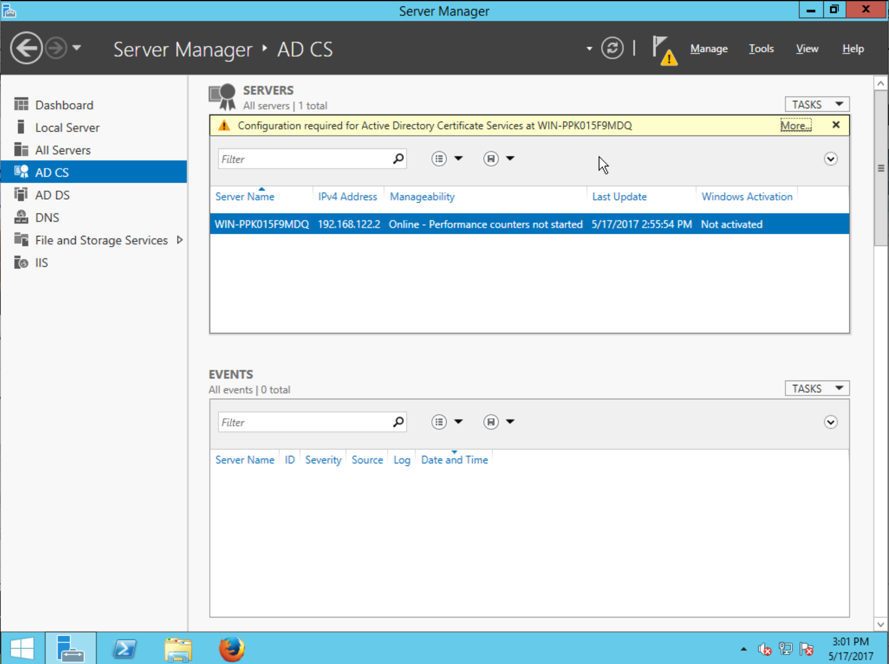
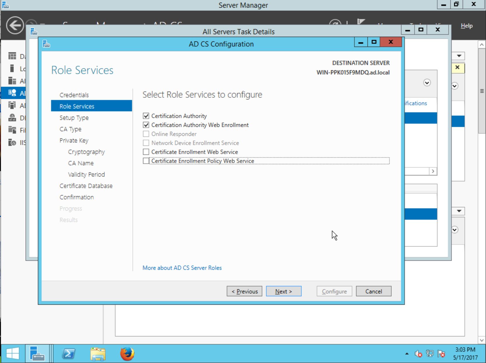
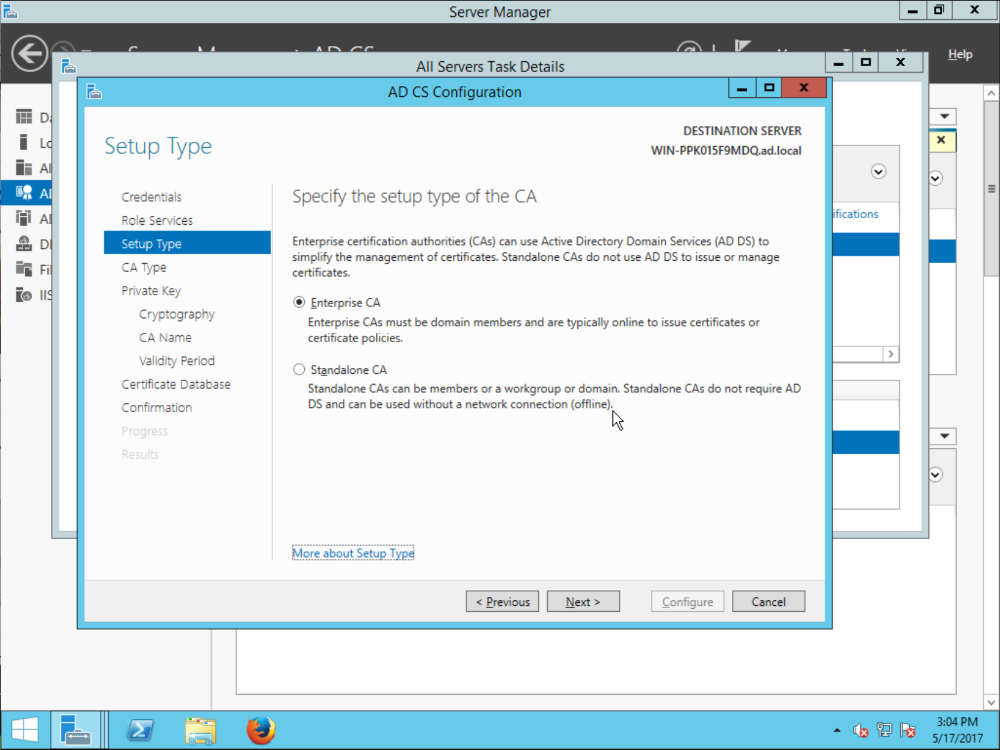
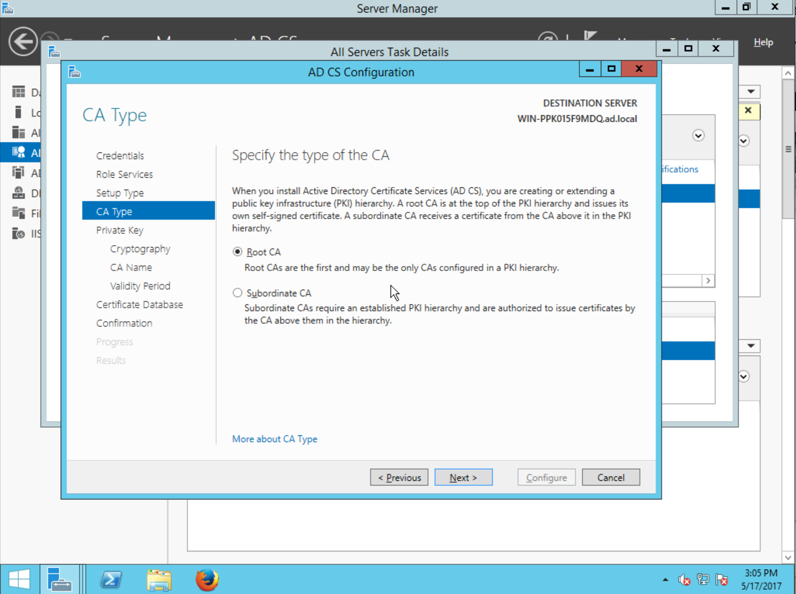
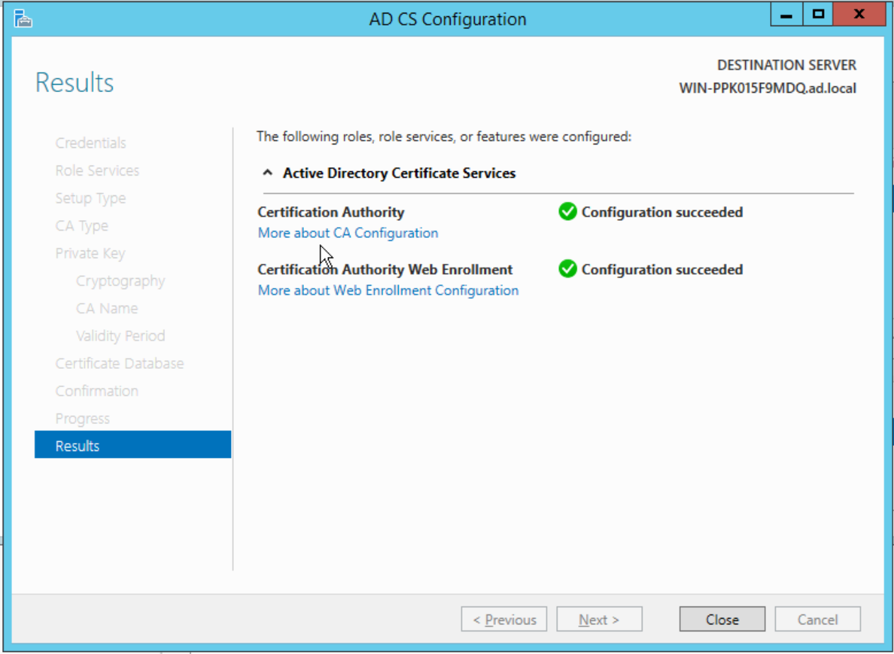
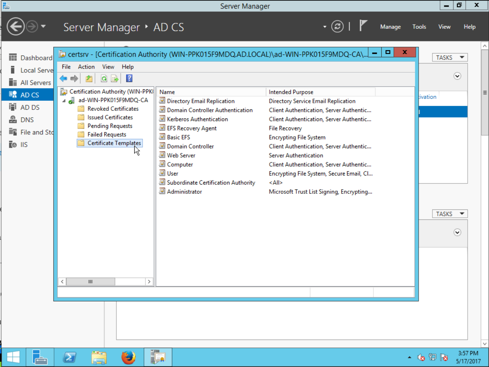
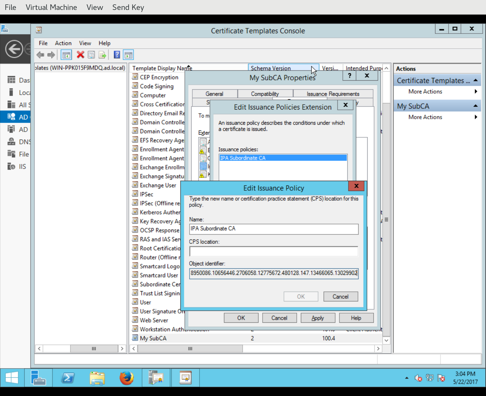

Installing FreeIPA with an Active Directory subordinate CA
==========================================================

FreeIPA is often installed in enterprise environments for managing
Unix and Linux hosts and services.  Most commonly, enterprises use
Microsoft *Active Directory* for managing users, Windows
workstations and Windows servers.  Often, Active Directory is
deployed with *Active Directory Certificate Services (AD CS)* which
provides a CA and certificate management capabilities.  Likewise,
FreeIPA includes the *Dogtag* CA, and when deploying FreeIPA in an
enterprise using AD CS, it is often desired to make the FreeIPA CA a
subordinate CA of the AD CS CA.

In this blog post I'll explain what is required to issue an AD
sub-CA, and how to do it with FreeIPA, including a step-by-step
guide to configuring AD CS.

AD CS certificate template overview
-----------------------------------

AD CS has a concept of *certificate templates*, which define the
characteristics an issued certificate shall have.  The same concept
exists in Dogtag and FreeIPA except that in those projects we call
them *certificate profiles*, and the mechanism to select which
template/profile to use when issuing a certificate is different.

In AD CS, the template to use is indicated by an X.509 extension in
the certificate signing request (CSR).  The template specifier can
be one of two extensions.  The first, older extension has OID
``1.3.6.1.4.1.311.20.2`` and allows you to specify a template by
name::

    CertificateTemplateName ::= SEQUENCE {
       Name            BMPString
    }

(Note that some documents specify ``UTF8String`` instead of
``BMPString``.  ``BMPString`` works and is used in practice.  I am
not actually sure if ``UTF8String`` even works.)

The second, *Version 2* template specifier extension has OID
``1.3.6.1.4.1.311.21.7`` and allows you to specify a template by OID
and version::

    CertificateTemplate ::= SEQUENCE {
        templateID              EncodedObjectID,
        templateMajorVersion    TemplateVersion,
        templateMinorVersion    TemplateVersion OPTIONAL
    }

    TemplateVersion ::= INTEGER (0..4294967295)

Note that some documents also show ``templateMajorVersion`` as
optional, but it is actually required.

When submitting a CSR for signing, AD CS looks for these extensions
in the request, and uses the extension data to select the template
to use.

External CA installation in FreeIPA
-----------------------------------

FreeIPA supports installation with an externally signed CA
certificate, via ``ipa-server-install --external-ca`` or (for
existing CA-less installations ``ipa-ca-install --external-ca``).
The installation takes several steps.  First, a key is generated and
a CSR produced::

  $ ipa-ca-install --external-ca

  Directory Manager (existing master) password: XXXXXXXX

  Configuring certificate server (pki-tomcatd). Estimated time: 3 minutes
    [1/8]: configuring certificate server instance
  The next step is to get /root/ipa.csr signed by your CA and re-run /sbin/ipa-ca-install as:
  /sbin/ipa-ca-install --external-cert-file=/path/to/signed_certificate --external-cert-file=/path/to/external_ca_certificate

The installation program exits while the administrator submits the
CSR to the external CA.  After they receive the signed CA
certificate, the administrator resumes the installation, giving the
installation program the CA certificate and a chain of one or more
certificates up to the root CA::

  $ ipa-ca-install --external-cert-file ca.crt --external-cert-file ipa.crt
  Directory Manager (existing master) password: XXXXXXXX

  Configuring certificate server (pki-tomcatd). Estimated time: 3 minutes
    [1/29]: configuring certificate server instance
    ...
    [29/29]: configuring certmonger renewal for lightweight CAs
  Done configuring certificate server (pki-tomcatd).

Recall, however, that if the external CA is AD CS, a CSR must bear
one of the certificate template specifier extensions.  There is an
additional installation program option to add the template
specifier::

  $ ipa-ca-install --external-ca --external-ca-type=ms-cs

This adds a *name-based* template specifier to the CSR, with the
name ``SubCA`` (this is the name of the default sub-CA template in
AD CS).

Specifying an alternative AD CS template
----------------------------------------

Everything discussed so far is already part of FreeIPA.  Until now,
there is no way to specify a different template to use with AD CS.

I have been working on a feature that allows an alternative AD CS
template to be specified.  Both kinds of template specifier
extension are supported, via the new ``--external-ca-profile``
installation program option::

  $ ipa-ca-install --external-ca --external-ca-type=ms-cs \
    --external-ca-profile=1.3.6.1.4.1.311.21.8.8950086.10656446.2706058.12775672.480128.147.7130143.4405632:1

(Note: huge OIDs like the above are commonly used by Active
Directory for installation-specific objects.)

To specify a template by name, the ``--external-ca-profile`` value
should be::

  --external-ca-profile=NAME

To specify a template by OID, the OID and major version must be
given, and optionally the minor version too::

  --external-ca-profile=OID:MAJOR[:MINOR]

Like ``--external-ca`` and ``--external-ca-type``, the new
``--external-ca-profile`` option is available with both
``ipa-server-install`` and ``ipa-ca-install``.

With this feature, it is now possible to specify an alternative or
custom certificate template when using AD CS to sign the FreeIPA CA
certificate.  The feature has not yet been merged but there an `open
pull request`_.  I have also made a `COPR build`_ for anyone
interested in testing the feature.

.. _open pull request: https://github.com/freeipa/freeipa/pull/930
.. _COPR build: https://copr.fedorainfracloud.org/coprs/ftweedal/freeipa-adcs-template/

The remainder of this post is a short guide to configuring Active
Directory Certificate Services, defining a custom CA profile, and
submitting a CSR to issue a certificate.

Renewing the certificate
------------------------

FreeIPA provides the ``ipa-cacert-manage renew`` command for
renewing an externally-signed CA certificate.  Like installation
with an externally-signed CA, this is a two-step procedure.  In the
first step, the command prompts Certmonger to generate a new CSR for
the CA certificate, and saves the CSR so that the administrator can
submit it to the external CA.

For renewing a certificate signed by AD CS, as in the installation
case a template specifier extension is needed.  Therefore the
``ipa-cacert-manage renew`` command has also learned the
``--external-ca-profile`` option::

  # ipa-cacert-manage renew --external-ca-type ms-cs \
    --external-ca-profile MySubCA
  Exporting CA certificate signing request, please wait
  The next step is to get /var/lib/ipa/ca.csr signed by your CA and re-run ipa-cacert-manage as:
  ipa-cacert-manage renew --external-cert-file=/path/to/signed_certificate --external-cert-file=/path/to/external_ca_certificate
  The ipa-cacert-manage command was successful

The the above example the CSR that was generated will contain a
*version 1* template extension, using the name ``MySubCA``.  Like
the installation commands, the *version 2* extension is also
supported.

This part of the feature requires some changes to Certmonger as well
as FreeIPA.  At time of writing these changes haven't been merged.
There is a `Certmonger pull request
<https://pagure.io/certmonger/pull-request/81>`_ and a `Certmonger
COPR build
<https://copr.fedorainfracloud.org/coprs/ftweedal/certmonger-v2template/>`_
if you'd like to test the feature.

Appendix A: installing and configuring AD CS
--------------------------------------------

Assuming an existing installation of Active Directory, AD CS
installation and configuration will take 10 to 15 minutes.  Open
**Server Manager**, invoke the **Add Roles and Features Wizard** and
select the AD CS **Certification Authority** role:

.. image:: ../images/ms-ca/ms-ca-installation.png

Proceed, and wait for the installation to complete...

.. image:: ../images/ms-ca/ms-ca-installation-progress.png

After installation has finished, you will see **AD CS** in the
Server Manager sidebar, and upon selecting it you will see a
notification that **Configuration required for Active Directory
Certificate Services**.

Click **More...**, and up will come the **All Servers Task Details**
dialog showing that the **Post-deployment Configuration** action is
pending.  Click the action to continue:

.. image:: ../images/ms-ca/ad-cs-post-deployment-configuration.png

Now comes the **AD CS Configuration** assistant, which contains
several steps.  Proceed past the **Specify credentials to configure
role services** step.

In the **Select Role Services to configure** step, select
**Certification Authority** then continue:

In the **Specify the setup type of the CA** step, choose
**Enterprise CA** then continue:

The **Specify the type of the CA** step lets you choose whether the
AD CS CA will be a root CA or chained to an external CA (just like
how FreeIPA lets you create root or subordinate CA!)  Installing AD
CS as a Subordinate CA is outside the scope of this guide.  Choose
**Root CA** and continue:

The next step lets you **Specify the type of the private key**.  You
can use an existing private key or **Create a new private key**, the
continue.

The **Specify the cryptographic options** step lets you specify the
**Key length** and **hash algorithm** for the signature.  Choose a
key length of at least **2048** bits, and the **SHA-256** digest:

.. image:: ../images/ms-ca/ad-cs-post-deploy-6-algs.png

Next, **Specify the name of the CA**.  This sets the *Subject
Distinguished Name* of the CA.  Accept defaults and continue.

The next step is to **Specify the validity period**.  CA
certificates (especially root CAs) typically need a long validity
period.  Choose a value like **5 Years**, then continue:

.. image:: ../images/ms-ca/ad-cs-post-deploy-8-validity.png

Accept defauts for the **Specify the database locations** step.

Finally, you will reach the **Confirmation** step, which summarises
the chosen configuration options.  Review the settings then
**Configure**:

.. image:: ../images/ms-ca/ad-cs-post-deploy-10-confirmation.png

The configuration will take a few moments, then the **Results** will
be displayed:

AD CS is now configured and you can begin issuing certificates.

Appendix B: creating a custom sub-CA certificate template
---------------------------------------------------------

In this section we look at how to create a new *certificate
template* for sub-CAs by duplicating an existing template, then
modifying it.

To manage certificate templates, from **Server Manager** right-click
the server and open the **Certification Authority** program:

.. image:: ../images/ms-ca/ad-cs-manage-1-open.png

In the sidebar tree view, *right-click* **Certificate Templates**
then select **Manage**.

The **Certificate Templates Console** will open.  The default
profile for sub-CAs has the Template Display Name *Subordinate
Certification Authority*.  *Right-click* this template and choose
**Duplicate Template**.

.. image:: ../images/ms-ca/ad-cs-manage-4-duplicate.png

The new template is created and the **Properties of New Template**
dialog appears, allowing the administrator to customise the
template.  You can set a new **Template display name**, **Template
name** and so on:

.. image:: ../images/ms-ca/ad-cs-manage-5-new-template.png

You can also change various aspects of certificate issuance
including which extensions will appear on the issued certificate,
and the values of those extensions.  In the following screenshot, we
see a new *Certificate Policies* OID being defined for addition to
certificates issued via this template:

Also under **Extensions**, you can discover the OID for this
template by looking at the **Certificate Template Information**
extension description.

Finally, having defined the new certificate template, we have to
activate it for use with the AD CA.  Back in the **Certification
Authority** management window, *right-click* **Certificate
Templates** and select **Certificate Template to Issue**:

.. image:: ../images/ms-ca/ad-cs-manage-7-enable-template.png

This will pop up the **Enable Certificate Templates** dialog,
containing a list of templates available for use with the CA.
Select the new template and click **OK**.  The new certificate
template is now ready for use.

Appendix C: issuing a certificate
---------------------------------

In this section we look at how to use AD CS to issue a certificate.
It is assumed that the CSR to be signed exists and Active Directory
can access it.

In the **Certification Authority** window, in the sidebar
*right-click* the CA and select **All Tasks >> Submit new
request...**:

.. image:: ../images/ms-ca/ad-cs-request-1-menu.png

This will bring up a file chooser dialog.  Find the CSR and **Open**
it:

.. image:: ../images/ms-ca/ad-cs-request-2-choose-csr.png

Assuming all went well (including the CSR indicating a known
certificate template), the certificate is immediately issued and the
**Save Certificate** dialog appear, asking where to save the issued
certificate.
